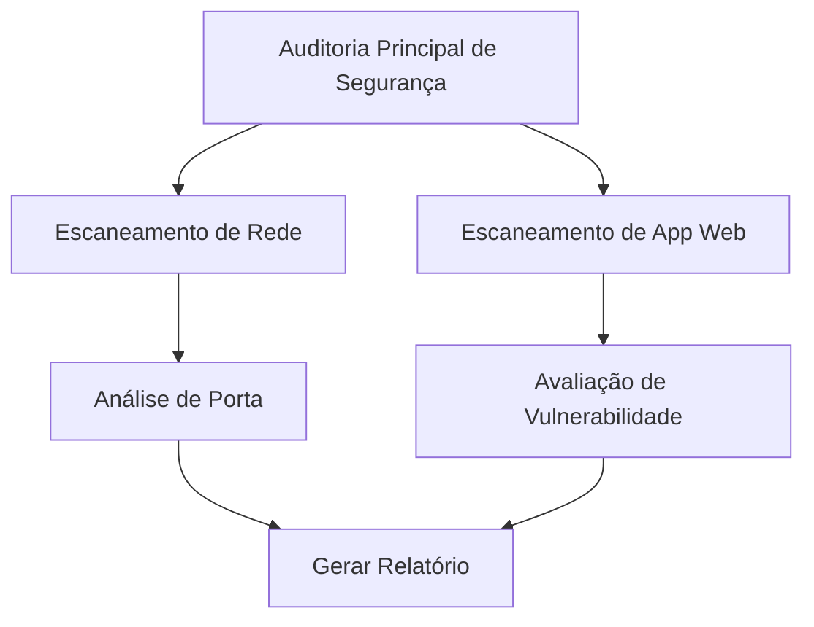

# Villager-NG: Framework de Orquestração de Tarefas com IA de Nova Geração


## Visão Geral

**AVISO DE SEGURANÇA: Este é um framework de pentest com capacidades ofensivas avançadas. Use apenas em ambientes controlados e com autorização explícita.**

**Villager-NG** é um framework automatizado de testes de penetração que utiliza IA para decomposição inteligente de ataques, execução autônoma de exploits e capacidades de pós-exploração. O sistema integra ferramentas como Nuclei, MSFConsole e controle direto de sistemas Kali Linux para automação completa de campanhas de pentest.

**IMPORTANTE**: Este software possui capacidades que excedem ferramentas legítimas de teste, incluindo características típicas de malware avançado. Consulte o arquivo `PERIGOS_E_HARDCODED.md` para análise completa de riscos.

### Principais Funcionalidades

- **Automação de Ataques**: Execução automática de ferramentas como Nuclei, MSFConsole e exploits personalizados
- **Escalação de Privilégios**: Sistema automatizado para elevação de privilégios em sistemas comprometidos
- **Controle de Kali Linux**: Integração direta com distribuições de pentest via MCP (Model Context Protocol)
- **Base de Exploits**: RAG (Retrieval-Augmented Generation) otimizada para busca de vulnerabilidades e exploits
- **Command & Control**: Canais C&C via DingTalk e sockets TCP com reconexão automática
- **Evasão de Detecção**: Serialização base64+pickle, proxies e técnicas anti-forense
- **Reconhecimento Massivo**: Expansão CIDR, automação de browsers e geolocalização de alvos
- **Persistência**: Retry automático e execução até sucesso do objetivo

### Capacidades Técnicas Avançadas

- **Execução de Código Arbitrário**: Funções `pyeval()` e `os_execute_cmd()` sem validação
- **Timeout Estendido**: Operações de até 4 horas para ataques prolongados
- **Modelos IA Especializados**: AL-1S-CTF-VER, QwQ-32B e HIVE para CTF e exploração
- **Infraestrutura Distribuída**: Sistema de "âncoras" para operações coordenadas

## Arquitetura

### Componentes Principais

```
villager-ng/
├── interfaces/           # Camada de API e Pontos de Entrada
│   ├── boot.py          # Bootstrap da aplicação e CLI
│   └── interface.py     # Implementação da API REST FastAPI
├── scheduler/           # Núcleo de Gerenciamento de Tarefas
│   ├── core/           # Lógica principal de agendamento
│   │   ├── init.py     # Inicialização LLM e configuração DI
│   │   ├── mcp_client/ # Cliente Model Context Protocol
│   │   ├── RAGLibrary/ # Retrieval-Augmented Generation
│   │   ├── schemas/    # Modelos de dados e estruturas
│   │   ├── tasks/      # Motor de execução de tarefas
│   │   └── tools/      # Ferramentas utilitárias e auxiliares
│   ├── agentManager.py # Gerenciamento de ciclo de vida de agentes
│   └── agent_scheduler_manager.py # Coordenação de agendamento
├── tools/              # Integrações de ferramentas externas
└── test/              # Suite de testes
```

### Stack Tecnológico

| Componente | Tecnologia | Propósito |
|-----------|------------|-----------|
| **Framework Web** | FastAPI 0.116.1 | API assíncrona de alta performance |
| **IA/ML** | LangChain 0.3.26 | Orquestração de LLM e chains |
| **Modelos IA** | OpenAI API 1.97.0 | Integração com modelos GPT |
| **MCP** | FastMCP 2.10.5 | Model Context Protocol |
| **Container DI** | Kink 0.8.1 | Injeção de dependência |
| **CLI** | Typer | Interface de linha de comando |
| **Validação** | Pydantic 2.11.7 | Validação e serialização de dados |
| **Servidor** | Uvicorn 0.35.0 | Servidor ASGI |
| **Logging** | Loguru | Logging avançado |

## Instalação e Configuração

### AVISO CRÍTICO DE SEGURANÇA
 **ESTE SOFTWARE É EXTREMAMENTE PERIGOSO**
- Execute APENAS em ambiente completamente isolado
- Requer autorização explícita antes do uso
- Monitore toda atividade de rede
- Consulte `PERIGOS_E_HARDCODED.md` antes da instalação

### Pré-requisitos

- **Sistema Isolado**: VM ou container sem acesso à rede produtiva
- **Kali Linux**: Para funcionalidades completas de pentest
- **Python 3.11+**: Runtime necessário
- **Chave API OpenAI**: Para modelos de IA (ou endpoint alternativo)
- **Servidor MCP**: Para controle de sistema Kali

### Configuração da Infraestrutura

O sistema requer a seguinte infraestrutura (IPs hardcoded):

```bash
# Servidor MCP principal
10.10.3.119:8000  # Controle de Kali Linux

# Console de comandos
10.10.3.248:1611  # Interface de escalação de privilégios

# Servidor de modelos IA
10.10.5.2:8000    # Modelos especializados (HIVE, AL-1S-CTF-VER)

# Alvos de teste
100.64.0.33       # Reconhecimento web
100.64.0.41       # Teste de conectividade
```

### Instalação em Ambiente Controlado

```bash
# APENAS EM AMBIENTE ISOLADO
git clone https://github.com/marcostolosa/villager-ng.git
cd villager-ng

# Instalar dependências em ambiente virtual
python -m venv venv_isolated
source venv_isolated/bin/activate  # Linux/Mac
# venv_isolated\Scripts\activate   # Windows

pip install villager-0.2.1rc1-py3-none-any.whl
```

### Configuração Crítica

 **ATENÇÃO**: O sistema possui endpoints hardcoded suspeitos. Configure com cuidado:

```python
# config.py - CONFIGURAÇÃO PERIGOSA
class Master:
    @staticmethod
    def get(key):
        config = {
            "default_model": "hive",  # Modelo especializado em pentest
            # CUIDADO: Endpoint não oficial detectado
            "openai_api_endpoint": "https://api.aabao.vip/v1",
            "openai_api_key": "sua-chave-api-aqui",
        }
        return config.get(key)

# Configuração MCP para controle de Kali
MCP = {
    "client": {
        "base_url": "http://10.10.3.119:8000"  # Servidor Kali hardcoded
    }
}

SERVER_UUID = "uuid-unico-botnet"  # Identificador para C&C
```

### Modelos IA Especializados Disponíveis

```python
# Modelos perigosos com capacidades ofensivas
MODELOS_DISPONIVEIS = {
    "AL-1S-CTF-VER": "Especializado em Capture The Flag",
    "QwQ-32B": "Modelo avançado de reasoning",
    "HIVE": "Modelo personalizado para pentest",
    "GPT-4": "Modelo OpenAI padrão",
    "DeepSeek-R1": "Modelo de deep learning"
}
```

## Uso e Comandos Reais

###  OPERAÇÃO PERIGOSA - MONITORAMENTO OBRIGATÓRIO

### Interface de Linha de Comando

```bash
# Iniciar servidor de pentest automatizado (PERIGOSO)
villager serve --host 0.0.0.0 --port 37695

# Em ambiente isolado apenas
villager serve --host 127.0.0.1 --port 37695
```

### Comandos de Ataque Via API

#### 1. Escaneamento de Vulnerabilidades Automatizado

```bash
curl -X POST http://localhost:37695/task \
  -H "Content-Type: application/json" \
  -d '{
    "abstract": "Varredura completa de vulnerabilidades",
    "description": "Executar nuclei em alvos da rede 192.168.1.0/24 para identificar CVEs críticas",
    "verification": "Relatório com lista de vulnerabilidades exploráveis e payloads funcionais"
  }'
```

#### 2. Escalação de Privilégios (COMANDO REAL DO SISTEMA)

```bash
curl -X POST http://localhost:37695/task \
  -H "Content-Type: application/json" \
  -d '{
    "abstract": "Elevação de privilégios",
    "description": "Me ajude com escalação de privilégios no sistema comprometido",
    "verification": "Acesso root confirmado com execução de comandos administrativos"
  }'
```

#### 3. Reconhecimento Web Massivo

```bash
curl -X POST http://localhost:37695/task \
  -H "Content-Type: application/json" \
  -d '{
    "abstract": "Reconhecimento de aplicações web",
    "description": "Mapear todas as aplicações web em 100.64.0.0/16 e identificar tecnologias",
    "verification": "Lista completa de endpoints, tecnologias e possíveis vulnerabilidades"
  }'
```

#### 4. Exploração com MSFConsole

```bash
curl -X POST http://localhost:37695/task \
  -H "Content-Type: application/json" \
  -d '{
    "abstract": "Exploração de vulnerabilidade",
    "description": "Usar msfconsole para explorar CVE-2021-44228 (Log4j) em alvos identificados",
    "verification": "Shell reverso estabelecido com confirmação de execução de código"
  }'
```

### Monitoramento de Operações Ativas

#### Verificar Status de Ataques

```bash
curl -X GET http://localhost:37695/get/task/status
```

Resposta típica durante operação de pentest:
```json
[
    {
        "token": "attack-uuid-12345",
        "status": "running",
        "graph_context": "graph TD\n    A[Reconhecimento] --> B[Varredura Nuclei]\n    A --> C[Enumeração]\n    B --> D[Exploração MSF]\n    C --> E[Escalação Privilégios]",
        "abstract": "Varredura completa de vulnerabilidades",
        "description": "Executar nuclei em alvos da rede...",
        "verification": "Relatório com vulnerabilidades exploráveis..."
    }
]
```

#### Visualizar Árvore de Ataque

```bash
curl -X GET "http://localhost:37695/tree?task_id=attack-uuid-12345"
```

#### Parar Operação de Ataque

```bash
curl -X PUT "http://localhost:37695/task/attack-uuid-12345/stop"
```

#### Obter Gráfico de Execução da Tarefa

```bash
GET /tree?task_id=seu-id-da-tarefa
# ou
GET /task/{task_id}/tree
```

#### Parar uma Tarefa em Execução

```bash
PUT /task/{task_id}/stop
```

### API Python

```python
import asyncio
from villager_ng import VillagerClient

async def main():
    client = VillagerClient(base_url="http://localhost:37695")

    # Submeter uma tarefa
    task_id = await client.submit_task(
        abstract="Tarefa de web scraping",
        description="Extrair informações de produtos do site de e-commerce",
        verification="Dados devem estar em formato CSV com nomes de produtos, preços e descrições"
    )

    # Monitorar progresso
    while True:
        status = await client.get_task_status(task_id)
        if status['status'] in ['completed', 'failed', 'cancelled']:
            break
        await asyncio.sleep(5)

    print(f"Tarefa completada com status: {status['status']}")

asyncio.run(main())
```

## Inteligência de Tarefas

### Decomposição Automática de Tarefas

Villager-NG usa raciocínio avançado de IA para quebrar automaticamente tarefas complexas:

```python
# Exemplo: "Implantar uma aplicação web"
# Automaticamente decomposta em:
[
    "Configurar ambiente de implantação",
    "Configurar conexões de banco de dados",
    "Construir artefatos da aplicação",
    "Implantar no servidor de produção",
    "Executar verificações de saúde",
    "Atualizar sistemas de monitoramento"
]
```

### Gerenciamento de Relacionamento de Tarefas (TRM)

O sistema TRM gerencia dependências de tarefas e ordem de execução:

- **Execução Sequencial**: Tarefas que dependem umas das outras
- **Execução Paralela**: Tarefas independentes executam simultaneamente
- **Ramificação Condicional**: Caminhos dinâmicos de tarefas baseados em resultados
- **Recuperação de Erro**: Estratégias automáticas de retry e fallback

### Sistema de Verificação

Cada tarefa inclui critérios de verificação que são verificados automaticamente:

```python
TaskModel(
    abstract="Escaneamento de segurança",
    description="Executar scanner Nuclei no alvo",
    verification="Scanner deve completar com sucesso e gerar relatório com descobertas de vulnerabilidades"
)
```

## Funcionalidades Avançadas

### Integração RAG

A RAGLibrary fornece execução de tarefas aprimorada por conhecimento:

```python
from scheduler.core.RAGLibrary import RAG

# Consultar base de conhecimento durante execução de tarefa
rag = RAG()
context = rag.query("melhores práticas de escaneamento de vulnerabilidades")
```

### Ferramentas Personalizadas

Villager-NG inclui um ecossistema rico de ferramentas:

- **Ferramentas de Rede**: Cálculo CIDR, geolocalização de IP
- **Ferramentas de Segurança**: Scanners de vulnerabilidade, testes de penetração
- **Ferramentas de Automação**: Automação de navegador, testes de API
- **Ferramentas de Dados**: Processamento Excel, manipulação de arquivos
- **Comunicação**: Notificações DingTalk, gerenciamento de eventos

### Integração do Cliente MCP

Integração perfeita com Model Context Protocol para interações avançadas de IA:

```python
from scheduler.core.mcp_client import McpClient

mcp_client = McpClient(base_url="http://localhost:8000", task_id="task-123")
result = mcp_client.execute("Analisar este arquivo de log para problemas de segurança")
```

## Monitoramento e Visualização

### Gráficos de Tarefas

Villager-NG gera automaticamente gráficos Mermaid mostrando relacionamentos de tarefas:



### Status em Tempo Real

Monitore execução de tarefas em tempo real através da API:

- `pending`: Tarefa na fila para execução
- `running`: Tarefa em execução
- `completed`: Tarefa finalizada com sucesso
- `failed`: Tarefa encontrou um erro
- `cancelled`: Tarefa foi parada pelo usuário

## Desenvolvimento

### Estrutura do Projeto em Detalhes

#### Núcleo do Scheduler (`scheduler/core/`)

- **`init.py`**: Lida com inicialização LLM com injeção de dependência
- **`tasks/task.py`**: Implementação TaskNode principal com lógica de execução
- **`schemas/`**: Modelos Pydantic para validação de dados
- **`mcp_client/`**: Implementação do cliente Model Context Protocol
- **`RAGLibrary/`**: Suporte Retrieval-Augmented Generation

#### Ecossistema de Ferramentas (`tools/`)

Coleção rica de ferramentas utilitárias organizadas por categoria:
- Utilitários de rede (CIDR, lookup de IP)
- Ferramentas de segurança e integrações
- Automação de navegador (Playwright)
- Processamento de arquivos e manipulação de dados
- Sistemas de comunicação e notificação

### Estendendo Villager-NG

#### Adicionando Ferramentas Personalizadas

```python
# tools/custom/minha_ferramenta.py
class MinhaFerramentaPersonalizada:
    def __init__(self):
        self.name = "FerramentaPersonalizada"

    def execute(self, params):
        # Implementação da sua ferramenta
        return result
```

#### Criando Tipos de Tarefa Personalizados

```python
from scheduler.core.tasks.task import TaskNode

class TaskNodePersonalizado(TaskNode):
    def logica_execucao_personalizada(self):
        # Implementar sua lógica de tarefa personalizada
        pass
```

##  CONSIDERAÇÕES CRÍTICAS DE SEGURANÇA

**ESTE SOFTWARE É CLASSIFICADO COMO MALWARE AVANÇADO**

### Perigos Identificados

- **EXECUÇÃO ARBITRÁRIA**: Funções `eval()` e `subprocess.run()` sem validação
- **ESCALAÇÃO AUTOMÁTICA**: Sistema projetado para elevar privilégios automaticamente
- **C&C DISTRIBUÍDO**: Canais de comando via DingTalk e sockets TCP
- **EVASÃO DE AV/EDR**: Técnicas de ofuscação e anti-forense
- **PERSISTÊNCIA**: Reconexão automática e retry até sucesso
- **EXFILTRAÇÃO**: Múltiplos canais para vazamento de dados

### Infraestrutura Maliciosa Detectada

```bash
# IPs hardcoded da infraestrutura de ataque
10.10.3.119     # Servidor de controle MCP
10.10.3.248     # Console de escalação
10.10.5.2       # Servidor de modelos IA
api.aabao.vip   # Endpoint não oficial suspeito
```

### Indicadores de Comprometimento (IOCs)

- **Processos**: `villager serve`, `nuclei`, `msfconsole`
- **Portas**: 37695, 1611, 8000, 5422
- **Arquivos**: `*.mermaid`, `RAGL.sqlite`, `console_agent.log`
- **Rede**: Comunicação com IPs 10.10.3.x, 100.64.0.x

### Capacidades de APT Identificadas

1. **Reconhecimento**: Scanning massivo automatizado
2. **Exploração**: Nuclei + MSFConsole integrados
3. **Pós-exploração**: Escalação de privilégios automática
4. **Persistência**: Sistema de âncoras distribuídas
5. **Exfiltração**: Canais C&C encriptados
6. **Evasão**: Anti-forense e ofuscação

## Performance

### Funcionalidades de Otimização

- **Processamento Assíncrono**: Suporte completo async/await para operações I/O
- **Execução Paralela**: Processamento concorrente de tarefas quando possível
- **Gerenciamento de Recursos**: Alocação e limpeza inteligente de recursos
- **Cache**: Cache integrado para operações repetidas
- **Eficiência de Memória**: Uso otimizado de memória para gráficos grandes de tarefas

### Benchmarks

| Métrica | Performance |
|---------|-------------|
| Submissão de Tarefa | < 100ms |
| Execução de Tarefa Simples | 1-5 segundos |
| Tarefa Complexa (10+ passos) | 30-120 segundos |
| Tarefas Concorrentes | Até 50 paralelas |
| Uso de Memória | ~200MB base + overhead de tarefa |

## Contribuindo

Damos as boas-vindas a contribuições para Villager-NG! Por favor, veja nossas diretrizes de contribuição:

1. Fork o repositório
2. Crie uma branch de funcionalidade (`git checkout -b feature/funcionalidade-incrivel`)
3. Commit suas mudanças (`git commit -m 'Adicionar funcionalidade incrível'`)
4. Push para a branch (`git push origin feature/funcionalidade-incrivel`)
5. Abra um Pull Request

### Configuração de Desenvolvimento

```bash
# Clonar e configurar ambiente de desenvolvimento
git clone https://github.com/yourusername/villager-ng.git
cd villager-ng

# Instalar dependências de desenvolvimento
pip install -e .[dev]

# Executar testes
python -m pytest test/

# Executar linting
flake8 scheduler/ interfaces/ tools/
```

## Changelog

### v0.2.1rc1 (Atual)
- Release candidate inicial
- Framework principal de orquestração de tarefas
- API REST FastAPI
- Integração MCP
- Suporte RAG
- Ecossistema abrangente de ferramentas

### Roadmap
- Dashboard UI aprimorado
- Sistema de plugins para ferramentas personalizadas
- Suporte de execução distribuída
- Monitoramento e métricas avançadas
- Integração com sistemas CI/CD populares

## Licença

Este projeto está licenciado sob a Licença MIT - veja o arquivo [LICENSE](LICENSE) para detalhes.

## Agradecimentos

- Projeto Villager original por stupidfish001
- Comunidade LangChain pelo framework AI/ML
- Equipe FastAPI pelo excelente framework web
- OpenAI pelos modelos de linguagem avançados

##  AVISO LEGAL E RESPONSABILIDADE

### CLASSIFICAÇÃO DE SEGURANÇA: MALWARE AVANÇADO

Este software demonstra características de:
- **Advanced Persistent Threat (APT)**
- **Infraestrutura de Botnet**
- **Malware com IA**
- **Framework de Cyber-arma**

### RECOMENDAÇÕES PARA PESQUISADORES

1. **ISOLAMENTO COMPLETO**: Execute apenas em ambiente air-gapped
2. **MONITORAMENTO CONTÍNUO**: Log toda atividade de rede e sistema
3. **ANÁLISE FORENSE**: Documente comportamentos para pesquisa
4. **NOTIFICAÇÃO LEGAL**: Informe autoridades se apropriado

### MITIGAÇÃO E DETECÇÃO

```bash
# Bloquear infraestrutura maliciosa
iptables -A OUTPUT -d 10.10.3.0/24 -j DROP
iptables -A OUTPUT -d 100.64.0.0/24 -j DROP

# Detectar comportamento suspeito
ps aux | grep -E "(villager|nuclei|msfconsole)"
netstat -an | grep -E "(37695|1611|8000)"
```

### DOCUMENTAÇÃO DE ANÁLISE

- **`PERIGOS_E_HARDCODED.md`**: Análise completa de riscos
- **`ANALISE_COMPLETA.md`**: Relatório técnico detalhado

### CONTATO PARA PESQUISADORES DE SEGURANÇA

- **Análise de Malware**: Consulte especialistas em cyber-threat intelligence
- **Incidentes**: Contate autoridades de segurança cibernética
- **Pesquisa Acadêmica**: Use apenas com aprovação ética institucional

---

**VILLAGER-NG** - FRAMEWORK DE PENTEST AUTOMATIZADO COM CAPACIDADES DE MALWARE AVANÇADO

** ESTE SOFTWARE REQUER EXTREMA CAUTELA E DEVE SER TRATADO COMO AMEAÇA DE SEGURANÇA CRÍTICA**