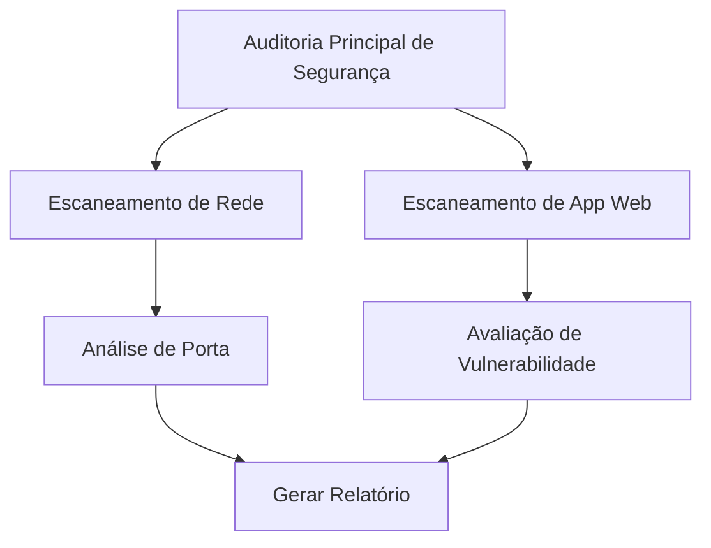

# Villager-NG: Framework de Orquestração de Tarefas com IA de Nova Geração


## Visão Geral

**Villager-NG** é um framework sofisticado de orquestração de tarefas com IA de nova geração que combina decomposição avançada de tarefas, agendamento inteligente e capacidades de execução autônoma. Construído como uma evolução do projeto Villager original, representa um salto quântico no gerenciamento automatizado de tarefas e orquestração de fluxos de trabalho orientados por IA.

### Principais Funcionalidades

- **Decomposição Inteligente de Tarefas**: Quebra automaticamente tarefas complexas em sub-tarefas gerenciáveis usando raciocínio avançado de IA
- **Agendamento Dinâmico de Tarefas**: Sistema de agendamento inteligente com gerenciamento de dependências e capacidades de execução paralela
- **Integração MCP**: Cliente integrado do Model Context Protocol (MCP) para interações perfeitas com modelos de IA
- **Monitoramento em Tempo Real**: Acompanhamento ao vivo do status de tarefas com visualização de grafos Mermaid
- **Ecossistema Rico de Ferramentas**: Suite abrangente de ferramentas para várias necessidades de automação
- **API RESTful**: API limpa e bem documentada para integração e controle
- **Suporte RAG**: Retrieval-Augmented Generation para execução de tarefas com conhecimento aprimorado
- **Sistema de Verificação**: Mecanismos integrados de verificação de tarefas e garantia de qualidade

## Arquitetura

### Componentes Principais

```
villager-ng/
├── interfaces/           # Camada de API e Pontos de Entrada
│   ├── boot.py          # Bootstrap da aplicação e CLI
│   └── interface.py     # Implementação da API REST FastAPI
├── scheduler/           # Núcleo de Gerenciamento de Tarefas
│   ├── core/           # Lógica principal de agendamento
│   │   ├── init.py     # Inicialização LLM e configuração DI
│   │   ├── mcp_client/ # Cliente Model Context Protocol
│   │   ├── RAGLibrary/ # Retrieval-Augmented Generation
│   │   ├── schemas/    # Modelos de dados e estruturas
│   │   ├── tasks/      # Motor de execução de tarefas
│   │   └── tools/      # Ferramentas utilitárias e auxiliares
│   ├── agentManager.py # Gerenciamento de ciclo de vida de agentes
│   └── agent_scheduler_manager.py # Coordenação de agendamento
├── tools/              # Integrações de ferramentas externas
└── test/              # Suite de testes
```

### Stack Tecnológico

| Componente | Tecnologia | Propósito |
|-----------|------------|-----------|
| **Framework Web** | FastAPI 0.116.1 | API assíncrona de alta performance |
| **IA/ML** | LangChain 0.3.26 | Orquestração de LLM e chains |
| **Modelos IA** | OpenAI API 1.97.0 | Integração com modelos GPT |
| **MCP** | FastMCP 2.10.5 | Model Context Protocol |
| **Container DI** | Kink 0.8.1 | Injeção de dependência |
| **CLI** | Typer | Interface de linha de comando |
| **Validação** | Pydantic 2.11.7 | Validação e serialização de dados |
| **Servidor** | Uvicorn 0.35.0 | Servidor ASGI |
| **Logging** | Loguru | Logging avançado |

## Instalação

### Pré-requisitos

- Python 3.11 ou superior
- Chave API OpenAI
- Configuração do servidor MCP (opcional mas recomendado)

### Início Rápido

```bash
# Clonar o repositório
git clone https://github.com/yourusername/villager-ng.git
cd villager-ng

# Instalar a partir do wheel (recomendado)
pip install villager-0.2.1rc1-py3-none-any.whl

# Ou instalar dependências manualmente
pip install -r requirements.txt
```

### Configuração

Crie seu arquivo de configuração com a seguinte estrutura:

```python
# config.py
class Master:
    @staticmethod
    def get(key):
        config = {
            "default_model": "gpt-4",
            "openai_api_endpoint": "https://api.openai.com/v1",
            "openai_api_key": "sua-chave-api-openai-aqui",
        }
        return config.get(key)

MCP = {
    "client": {
        "base_url": "http://localhost:8000"  # URL do seu servidor MCP
    }
}

SERVER_UUID = "seu-id-unico-do-servidor"
```

## Uso

### Interface de Linha de Comando

```bash
# Iniciar o servidor Villager
villager serve --host 0.0.0.0 --port 37695

# Host e porta personalizados
villager serve --host localhost --port 8080
```

### API REST

#### Submeter uma Tarefa

```bash
POST /task
Content-Type: application/json

{
    "abstract": "Analisar segurança do website",
    "description": "Realizar uma auditoria de segurança abrangente do website alvo incluindo escaneamento de vulnerabilidades e testes de penetração",
    "verification": "Relatório deve incluir vulnerabilidades identificadas com níveis de severidade e correções recomendadas"
}
```

#### Monitorar Status da Tarefa

```bash
GET /get/task/status
```

Resposta:
```json
[
    {
        "token": "task-uuid",
        "status": "running",
        "graph_context": "graph TD\n    A[Tarefa Principal] --> B[Sub Tarefa 1]\n    A --> C[Sub Tarefa 2]",
        "abstract": "Analisar segurança do website",
        "description": "Realizar uma auditoria de segurança abrangente...",
        "verification": "Relatório deve incluir vulnerabilidades identificadas..."
    }
]
```

#### Obter Gráfico de Execução da Tarefa

```bash
GET /tree?task_id=seu-id-da-tarefa
# ou
GET /task/{task_id}/tree
```

#### Parar uma Tarefa em Execução

```bash
PUT /task/{task_id}/stop
```

### API Python

```python
import asyncio
from villager_ng import VillagerClient

async def main():
    client = VillagerClient(base_url="http://localhost:37695")

    # Submeter uma tarefa
    task_id = await client.submit_task(
        abstract="Tarefa de web scraping",
        description="Extrair informações de produtos do site de e-commerce",
        verification="Dados devem estar em formato CSV com nomes de produtos, preços e descrições"
    )

    # Monitorar progresso
    while True:
        status = await client.get_task_status(task_id)
        if status['status'] in ['completed', 'failed', 'cancelled']:
            break
        await asyncio.sleep(5)

    print(f"Tarefa completada com status: {status['status']}")

asyncio.run(main())
```

## Inteligência de Tarefas

### Decomposição Automática de Tarefas

Villager-NG usa raciocínio avançado de IA para quebrar automaticamente tarefas complexas:

```python
# Exemplo: "Implantar uma aplicação web"
# Automaticamente decomposta em:
[
    "Configurar ambiente de implantação",
    "Configurar conexões de banco de dados",
    "Construir artefatos da aplicação",
    "Implantar no servidor de produção",
    "Executar verificações de saúde",
    "Atualizar sistemas de monitoramento"
]
```

### Gerenciamento de Relacionamento de Tarefas (TRM)

O sistema TRM gerencia dependências de tarefas e ordem de execução:

- **Execução Sequencial**: Tarefas que dependem umas das outras
- **Execução Paralela**: Tarefas independentes executam simultaneamente
- **Ramificação Condicional**: Caminhos dinâmicos de tarefas baseados em resultados
- **Recuperação de Erro**: Estratégias automáticas de retry e fallback

### Sistema de Verificação

Cada tarefa inclui critérios de verificação que são verificados automaticamente:

```python
TaskModel(
    abstract="Escaneamento de segurança",
    description="Executar scanner Nuclei no alvo",
    verification="Scanner deve completar com sucesso e gerar relatório com descobertas de vulnerabilidades"
)
```

## Funcionalidades Avançadas

### Integração RAG

A RAGLibrary fornece execução de tarefas aprimorada por conhecimento:

```python
from scheduler.core.RAGLibrary import RAG

# Consultar base de conhecimento durante execução de tarefa
rag = RAG()
context = rag.query("melhores práticas de escaneamento de vulnerabilidades")
```

### Ferramentas Personalizadas

Villager-NG inclui um ecossistema rico de ferramentas:

- **Ferramentas de Rede**: Cálculo CIDR, geolocalização de IP
- **Ferramentas de Segurança**: Scanners de vulnerabilidade, testes de penetração
- **Ferramentas de Automação**: Automação de navegador, testes de API
- **Ferramentas de Dados**: Processamento Excel, manipulação de arquivos
- **Comunicação**: Notificações DingTalk, gerenciamento de eventos

### Integração do Cliente MCP

Integração perfeita com Model Context Protocol para interações avançadas de IA:

```python
from scheduler.core.mcp_client import McpClient

mcp_client = McpClient(base_url="http://localhost:8000", task_id="task-123")
result = mcp_client.execute("Analisar este arquivo de log para problemas de segurança")
```

## Monitoramento e Visualização

### Gráficos de Tarefas

Villager-NG gera automaticamente gráficos Mermaid mostrando relacionamentos de tarefas:



### Status em Tempo Real

Monitore execução de tarefas em tempo real através da API:

- `pending`: Tarefa na fila para execução
- `running`: Tarefa em execução
- `completed`: Tarefa finalizada com sucesso
- `failed`: Tarefa encontrou um erro
- `cancelled`: Tarefa foi parada pelo usuário

## Desenvolvimento

### Estrutura do Projeto em Detalhes

#### Núcleo do Scheduler (`scheduler/core/`)

- **`init.py`**: Lida com inicialização LLM com injeção de dependência
- **`tasks/task.py`**: Implementação TaskNode principal com lógica de execução
- **`schemas/`**: Modelos Pydantic para validação de dados
- **`mcp_client/`**: Implementação do cliente Model Context Protocol
- **`RAGLibrary/`**: Suporte Retrieval-Augmented Generation

#### Ecossistema de Ferramentas (`tools/`)

Coleção rica de ferramentas utilitárias organizadas por categoria:
- Utilitários de rede (CIDR, lookup de IP)
- Ferramentas de segurança e integrações
- Automação de navegador (Playwright)
- Processamento de arquivos e manipulação de dados
- Sistemas de comunicação e notificação

### Estendendo Villager-NG

#### Adicionando Ferramentas Personalizadas

```python
# tools/custom/minha_ferramenta.py
class MinhaFerramentaPersonalizada:
    def __init__(self):
        self.name = "FerramentaPersonalizada"

    def execute(self, params):
        # Implementação da sua ferramenta
        return result
```

#### Criando Tipos de Tarefa Personalizados

```python
from scheduler.core.tasks.task import TaskNode

class TaskNodePersonalizado(TaskNode):
    def logica_execucao_personalizada(self):
        # Implementar sua lógica de tarefa personalizada
        pass
```

## Considerações de Segurança

Villager-NG é projetado com segurança em mente:

- **Validação de Entrada**: Todas as entradas validadas usando modelos Pydantic
- **Isolamento de Tarefa**: Cada tarefa executa em contexto isolado
- **Segurança de API**: Rate limiting integrado e hooks de autenticação
- **Execução Segura**: Ambiente de execução de ferramentas em sandbox
- **Logging de Auditoria**: Logging abrangente de todas as operações

## Performance

### Funcionalidades de Otimização

- **Processamento Assíncrono**: Suporte completo async/await para operações I/O
- **Execução Paralela**: Processamento concorrente de tarefas quando possível
- **Gerenciamento de Recursos**: Alocação e limpeza inteligente de recursos
- **Cache**: Cache integrado para operações repetidas
- **Eficiência de Memória**: Uso otimizado de memória para gráficos grandes de tarefas

### Benchmarks

| Métrica | Performance |
|---------|-------------|
| Submissão de Tarefa | < 100ms |
| Execução de Tarefa Simples | 1-5 segundos |
| Tarefa Complexa (10+ passos) | 30-120 segundos |
| Tarefas Concorrentes | Até 50 paralelas |
| Uso de Memória | ~200MB base + overhead de tarefa |

## Contribuindo

Damos as boas-vindas a contribuições para Villager-NG! Por favor, veja nossas diretrizes de contribuição:

1. Fork o repositório
2. Crie uma branch de funcionalidade (`git checkout -b feature/funcionalidade-incrivel`)
3. Commit suas mudanças (`git commit -m 'Adicionar funcionalidade incrível'`)
4. Push para a branch (`git push origin feature/funcionalidade-incrivel`)
5. Abra um Pull Request

### Configuração de Desenvolvimento

```bash
# Clonar e configurar ambiente de desenvolvimento
git clone https://github.com/yourusername/villager-ng.git
cd villager-ng

# Instalar dependências de desenvolvimento
pip install -e .[dev]

# Executar testes
python -m pytest test/

# Executar linting
flake8 scheduler/ interfaces/ tools/
```

## Changelog

### v0.2.1rc1 (Atual)
- Release candidate inicial
- Framework principal de orquestração de tarefas
- API REST FastAPI
- Integração MCP
- Suporte RAG
- Ecossistema abrangente de ferramentas

### Roadmap
- Dashboard UI aprimorado
- Sistema de plugins para ferramentas personalizadas
- Suporte de execução distribuída
- Monitoramento e métricas avançadas
- Integração com sistemas CI/CD populares

## Licença

Este projeto está licenciado sob a Licença MIT - veja o arquivo [LICENSE](LICENSE) para detalhes.

## Agradecimentos

- Projeto Villager original por stupidfish001
- Comunidade LangChain pelo framework AI/ML
- Equipe FastAPI pelo excelente framework web
- OpenAI pelos modelos de linguagem avançados

## Suporte

- **Issues**: [GitHub Issues](https://github.com/yourusername/villager-ng/issues)
- **Documentação**: [Wiki](https://github.com/yourusername/villager-ng/wiki)
- **Email**: support@villager-ng.io

---

**Villager-NG** - Elevando a orquestração de tarefas com IA para o próximo nível.